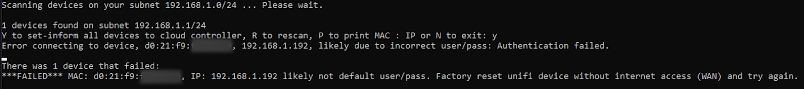

# bulk-local-unifi-to-cloud-controller

Readme File for bulk SSH local lan to unifi controller

This script is designed to discover Unifi devices on a network and configure their inform settings for management by a Unifi controller.

The script utilizes Python 3 with the following dependencies:

- Paramiko
- Scapy

To run the script, clone the repository and execute the Python script. The script will begin by discovering devices on the local network, matching the manufacturer's MAC address prefix (OUI) to Unifi devices, and then configuring their inform settings using SSH.


The script includes the following notable functions:

- get_ip() - finds the IP address of the device running the script and adds /24.
- scan(ip) - uses the /24 subnet to ARP the network and create a key-value dictionary of MAC addresses and their corresponding IP addresses.
- match_macs(scanned_output) - matches Unifi devices by their MAC address prefixes and adds them to a dictionary.
- ssh_conn(mac, ip) - connects to a device via SSH and sets the inform setting for the Unifi device.
- ssh_thread(ubiquiti_devices) - multi-threads the SSH connections.


After discovering and configuring devices, you're prompted to enter "exit" to quit. This is to ensure you have time to view the failed devices. The script outputs any devices that failed to connect or authenticate.

Note that the script currently uses default username and password credentials for Unifi devices (ubnt:ubnt). The "set-inform" is currently blank and needs to be changed to your desired location. To customise these settings, edit the ssh_connect() function accordingly, specifically the value of 'command' for the "set-inform".

You may also be required to download NMAP (https://nmap.org/) If you don't already have it on your device.

Contributions and feedback are welcome.

## **How to install and run on Windows** (works on MAC & Linux also but not covered in this how to)

1, Go to microsoft store and download the latest python version (currently 3.11 as of readme creation)

2, Once that is installed, create a folder location where you want to store the script.


3, Open cmd prompt and cd into the folder you just created.


4, Run git clone on this repo: ```git clone https://github.com/Wonco/bulk-local-unifi-to-cloud-controller.git```


5, Open file explorer and browse to the cloned folder.


6, Right click local_lan_to_unifi_controller.py and open with (editor of your choice)


7, Find the function ssh_connect and inside it find the line with variable "command" on it, this is where you set your desired controller location (ip or hostname). Make sure you save it before closing. e.g. ```set-inform http://examplehostname.com:8080/inform``` or ```set-inform http://10.2.15.254:8080/inform```


8, Go back to cmd and cd into the new cloned folder.


9, Run the .py with this command: ```python local_lan_to_unifi_controller.py```


10, If error paramiko, enter the command: ```pip install paramiko```


11, If error scapy, enter the command: ```pip install scapy```


12, Try and run the .py again with: ```python local_lan_to_unifi_controller.py```


13, Follow prompts in script, if no Ubiquiti OUIs found, it will not run and notify you it didn't find any.


14, GIF of script


                                              .                                 
                                     *//////(((((((((((*                        
                                 /////(((((((((((((#######(                     
                              *///(((((((((((#############%%#                   
                           *//(((((((((##############%%%%%%%%%#                 
                         //((((((#############%%%%%%%%%%%%%&&&&&                
                       //((((###########%%%%%%%%%%%%%%&&&&&&&&&&&               
                      /(((#########%%#%%%%%%%%%%%&%&&&&&&&&&&&@&@&              
                    /((########%%%%%%%%%%%%%%&%&&&&&&&&&&&&&&@@@@@@             
                   ((######*   /*    %%%%&&&&&&&&&&&&&&&&@@@@@@@@@@             
                  (####%% %%%%%%%%%%&  %&&&&&&&&&&&&&&&@@@@@@@@@@@@             
                 ###%%%.%%%%%%&&&&&&&&, &&&&&&&&&&&&&@@@@@@@@@@@@@@@            
                ##%%%%*%%%%&&&&&&&&&&&&  &&&&&&&&&&@@@@@@@@@@@@@@@@@            
               #%%%%&%&&&&&&&&&&&&&&&&&/ &&&&&&&&&@@@@@@@@@@@@@@@@@@            
               %%%%&.&&&&&&*&*&&&&&&&&&* &&&&&&&&@@@@@@@@@@@@@@@@@@@            
              %%%&&/&&&&&&*U&*&&&&&&&&& %&&&&&&&@@@@@@@@@@@@@@@@@@@             
              %&&&&*&&&&&&&@&&&&&&&&&&% &&&&&&@@@@@@@@@@@@@@@@@@@@@             
             %&&&&&*&&&&&&&&&&&&&&&&&& &&&&@@@@@@@@@@@@@@@@@@@@@@@@             
             &&&&&&(#&&&&&&&&&&&&&&&( &&@&&@@@@@@@@@@@@@@@@@@@@@@@              
             &&&&&&&,&&&&&&&&@&&&&@ .&@@@@@@@@@@@@@@@@@@@@@@@@@@@               
             &&&&&&&&*.&&&@&&&&@.. @@@@@@@@@@@@@@@@@@@@@@@@@@@@@@               
             &&&&&&&&&&*......./@@@@@@@@@@@@@@@@@@@@@@@@@@@@@@@@                
             (%&&&&&&&&&&@@@@@@@@@@@@@@@@@@@@@@@@@@@@@@@@@@@@@@                 
              %&&&&&&&&&@@@@@@@@@@@@@@@@@@@@@@@@@@@@@@@@@@@@@@                  
              %%&&&&&&&&@@@@@@@@@@@@@@@@@@@@@@@@@@@@@@@@@@@@                    
               %&&&&&&&&@@@@@@@@@@@@@@@@@@@@@@@@@@@@@@@@@@@                     
                %&&&&&&&@@@@@@@@@@@@@@@@@@@@@@@@@@@@@@@@@                       
                 %&&&&&&&@@@@@@@@@@@@@@@@@@@@@@@@@@@@@@%                        
                  &&&&&&&&@@@@@@@@@@@@@@@@@@@@@@@@@@@.                          
                    &&&&&&&@@@@@@@@@@@@@@@@@@@@@@@@                             
                      ,&&&&&&@@@@@@@@@@@@@@@@@@@                                
                          &&&&&@@@@@@@@@@@@&                                    

